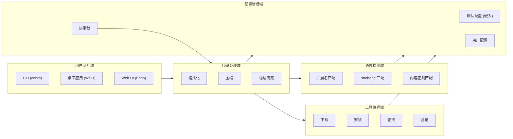
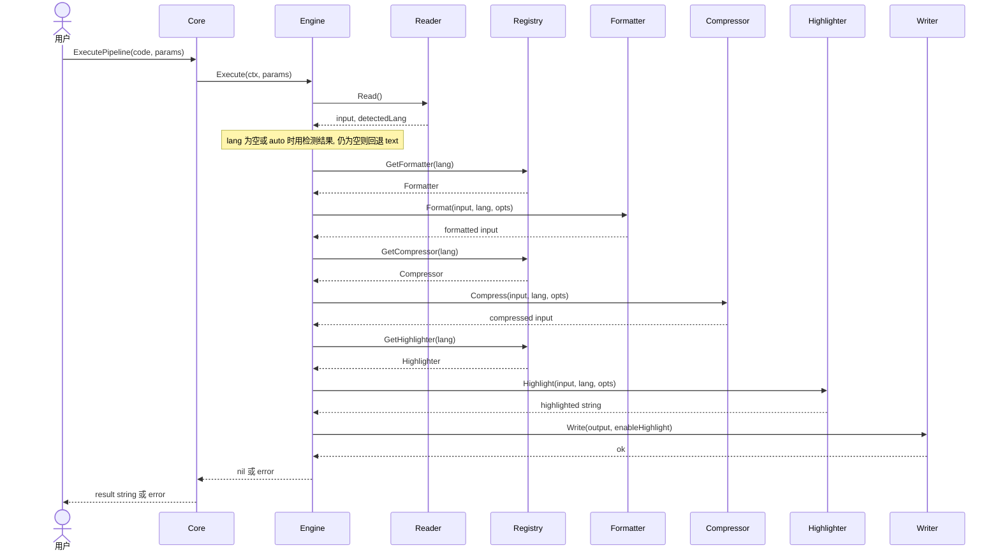
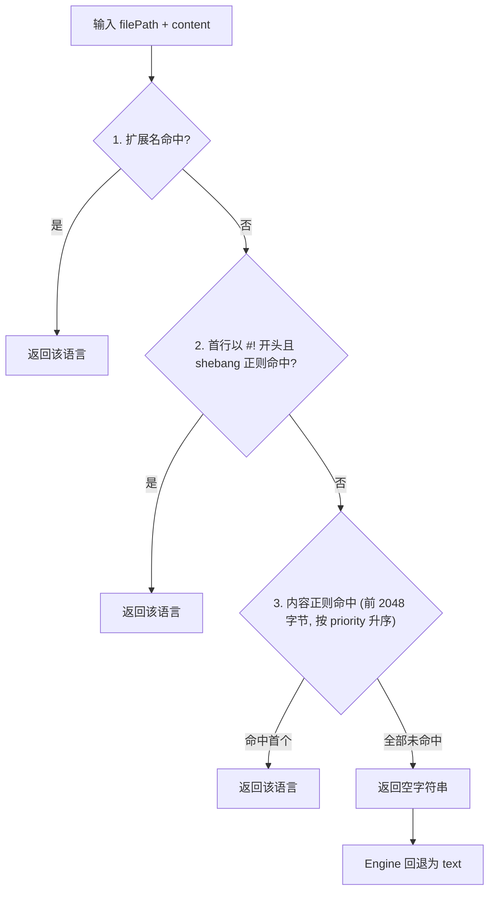
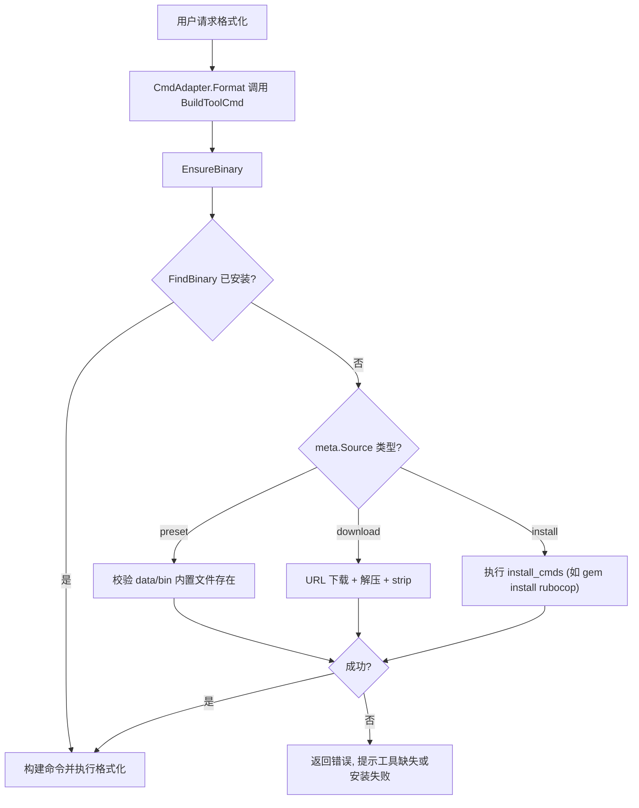
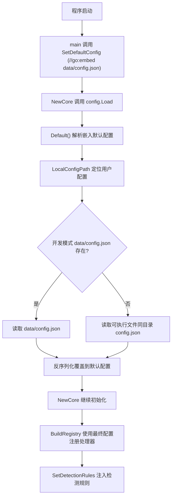

# 业务架构
> 生成时间：2026-08-01 ｜ 代码版本：master@9b25e57

## 1. 业务域划分

Formatter 的业务能力围绕「代码处理」这一核心诉求展开，按职责划分为 5 个业务域。各域之间通过配置驱动与注册表解耦，用户交互域统一收敛到共享核心 `appcommon.Core`，保证 CLI、桌面应用、Web UI 三端行为一致。

| 业务域 | 核心职责 | 关键代码位置 |
|--------|----------|--------------|
| 代码处理域 | 串联格式化、压缩、高亮三阶段流水线 | [pipeline/engine.go](../../src/pipeline/engine.go) |
| 语言检测域 | 扩展名、shebang、内容正则三级检测 | [io/detect.go](../../src/io/detect.go) |
| 工具管理域 | 外部二进制工具的下载、安装、查找、验证 | [binary/manager.go](../../src/binary/manager.go) |
| 配置管理域 | 嵌入默认配置、用户配置覆盖、配置热重载 | [config/config.go](../../src/config/config.go) |
| 用户交互域 | CLI、桌面应用、Web UI 三种交互入口 | [cli.go](../../src/cli.go) · [wailsapp/wails.go](../../src/wailsapp/wails.go) · [ui/server.go](../../src/ui/server.go) |

## 2. 语言支持矩阵

所有语言/工具/检测规则均由 [data/config.json](../../data/config.json) 驱动，共支持 20 种语言。高亮器列虽在各语言配置中为 `null`，但 [BuildRegistry()](../../src/appcommon/core.go#L339-L410) 会为所有配置语言统一注册 chroma 高亮器。

| 语言 | 扩展名 | 格式化器 | 压缩器 | 高亮器 |
|---|---|---|---|---|
| applescript | .applescript, .scpt | tool/applescript-wrapper | — | chroma |
| css | .css, .scss, .less | tool/oxfmt-wrapper | native/css | chroma |
| go | .go | native/go | — | chroma |
| html | .html, .htm | native/html | native/html | chroma |
| java | .java | tool/java-wrapper | — | chroma |
| javascript | .js, .jsx, .mjs, .cjs | tool/oxfmt-wrapper | native/js | chroma |
| json | .json | native/json | native/json | chroma |
| lua | .lua | tool/stylua | — | chroma |
| python | .py, .pyw | tool/ruff | — | chroma |
| ruby | .rb | tool/rubocop | — | chroma |
| rust | .rs | tool/prettyplease-cli | — | chroma |
| scala | .scala, .sc | tool/scalafmt | — | chroma |
| shell | .sh, .bash, .zsh, .ksh | tool/shfmt | — | chroma |
| sql | .sql | tool/sleek | native/sql | chroma |
| ini | .ini, .cfg | native/ini | — | chroma |
| properties | .properties | native/properties | — | chroma |
| toml | .toml | native/toml | — | chroma |
| typescript | .ts, .tsx | tool/oxfmt-wrapper | — | chroma |
| xml | .xml | native/xml | native/xml | chroma |
| yaml | .yaml, .yml | native/yaml | — | chroma |

**语言别名**（来自 `config.json` 的 `aliases` 字段，仅对 formatter/compressor 查找生效，高亮器由 chroma 原生处理各变体）：

- `bash` → `shell`
- `sh` → `shell`
- `zsh` → `shell`
- `yml` → `yaml`

**运行时依赖**（4 个，定义于 `config.json` 的 `binary.runtimes`，由 [runtime.go](../../src/appcommon/runtime.go) 检测）：

| 运行时 | 可执行文件 | 备选检测名 | 服务的工具 |
|--------|------------|------------|------------|
| node | node | node | oxfmt-wrapper（间接，调用 oxfmt 原生二进制，无需 node） |
| python | python3 | python3, python | ruff（ruff 为独立二进制，实际不依赖 python 运行时） |
| java | java | java | java-wrapper（调用 `java -jar google-java-format.jar`）、scalafmt（原生二进制，不依赖 java） |
| ruby | ruby | ruby | rubocop（通过 `gem install` 安装，运行需 ruby） |

> 注：上表「服务的工具」中标注「无需/不依赖」者，是因为这些工具本身是独立可执行二进制，运行时字段为空；仅 rubocop 与 java-wrapper 真正依赖运行时。

## 3. 包职责矩阵

| 包路径 | 职责 | 不负责 | 依赖 | 被依赖 |
|--------|------|--------|------|--------|
| [src/appcommon](../../src/appcommon/core.go) | 三模式共享核心 `Core`；[BuildRegistry()](../../src/appcommon/core.go#L339-L410) 注册表构建；流水线参数构建；配置 CRUD；运行时检测；二进制安装/验证 | 具体格式化/压缩/高亮算法；前端页面 | binary, compressor, config, formatter, highlighter, io, pipeline, registry | ui, wailsapp, cli, main |
| [src/config](../../src/config/config.go) | 配置结构定义；[Load/Save](../../src/config/config.go#L223-L237)；[SetDefaultConfig](../../src/config/config.go#L15-L17) 注入嵌入配置；命令参数模板展开 ([cmd_args.go](../../src/config/cmd_args.go))；`~` 路径展开 | 配置 CRUD 业务逻辑；处理器注册 | 无内部依赖（仅 stdlib） | appcommon, pipeline, binary, io, formatter/tool, compressor/tool |
| [src/pipeline](../../src/pipeline/engine.go) | 流水线引擎 [Engine.Execute](../../src/pipeline/engine.go#L40-L96)：Read → Format → Compress → Highlight → Write | 处理器实现；配置加载 | compressor, config, formatter, highlighter, io, registry | appcommon |
| [src/registry](../../src/registry/registry.go) | Formatter/Compressor/Highlighter 统一注册与查找；语言别名（仅对 formatter/compressor 生效） | 处理器实现；工具二进制管理 | formatter, compressor, highlighter（接口） | appcommon |
| [src/formatter](../../src/formatter/interface.go) (interface + native + tool) | `Formatter` 接口与 `BackendType`；native 实现 (go/json/yaml/xml/html/sql/ini/properties/toml)；[tool.CmdAdapter](../../src/formatter/tool/cmd_adapter.go) 外部工具适配器 | 压缩；高亮；工具下载 | native→formatter；tool→binary, config, formatter | registry, pipeline, appcommon |
| [src/compressor](../../src/compressor/interface.go) (interface + native + tool) | `Compressor` 接口；native 实现 (css/html/js/json/xml/sql)；tool 适配器 | 格式化；高亮 | native→compressor；tool→binary, config, compressor | registry, pipeline, appcommon |
| [src/highlighter](../../src/highlighter/chroma.go) | `Highlighter` 接口；[Chroma](../../src/highlighter/chroma.go) 实现（唯一后端）；主题注册 ([themes/](../../src/highlighter/themes_register.go)) | 格式化；压缩 | chroma 库（无内部依赖） | registry, pipeline, appcommon |
| [src/io](../../src/io/reader.go) | BufferReader/FileReader/StdinReader/ClipboardReader；BufferWriter/FileWriter/ClipboardWriter；[语言自动检测](../../src/io/detect.go) | 处理器；配置持久化 | config（检测规则） | pipeline, appcommon |
| [src/binary](../../src/binary/manager.go) | 二进制工具注册表 `BinaryMeta`；[下载/查找/验证/安装/移除](../../src/binary/manager.go#L200-L273)；归档解压 ([extractor.go](../../src/binary/extractor.go)) | 格式化逻辑；配置结构 | config | appcommon, formatter/tool, compressor/tool |
| [src/ui](../../src/ui/server.go) | Web Server (Echo)；静态前端（原生 HTML/CSS/JS，零外部依赖） | 桌面 WebView；CLI | appcommon | main |
| [src/wailsapp](../../src/wailsapp/wails.go) | Wails 桌面应用绑定（App 方法暴露给前端 WebView） | Web Server；CLI | appcommon | main |

## 4. 核心业务流程

### 4.1 代码处理流程

用户交互域任一入口（CLI/Wails/Web）最终都委托给 [Core.ExecutePipeline()](../../src/appcommon/core.go#L81-L90)，由 [Engine.Execute](../../src/pipeline/engine.go#L40-L96) 串联五阶段流水线。格式化、压缩、高亮三阶段均受 `Enable*` 开关控制，按需执行。

> 阶段失败行为：无 formatter/highlighter 直接报错；无 compressor 时按 `CompressSkipUnsupported` 决定报错或跳过；任一阶段失败立即返回错误包裹上下文。

### 4.2 语言检测流程

[DectLanguage()](../../src/io/detect.go#L102-L126) 采用三级优先级策略，所有规则来自 `config.json` 的 `detection` 字段，由 [SetDetectionRules()](../../src/io/detect.go#L37-L91) 在启动和配置变更时编译注入。

> 检测要点：扩展名优先于 shebang（符合「按文件类型格式化」语义）；内容正则仅扫描前 2048 字节，按 `priority` 升序匹配（数值小者先），同优先级按语言名字母序保证确定性；无效正则会被跳过。

### 4.3 工具安装流程

外部工具格式化器在执行时通过 [CmdAdapter](../../src/formatter/tool/cmd_adapter.go) 调用 [BuildToolCmd()](../../src/binary/manager.go#L25-L35)，触发 [EnsureBinary()](../../src/binary/manager.go#L201-L216) 按需安装。查找优先级：配置 `Path` > 安装目录 (`data/bin`) > 系统 `PATH`。

> 来源类型说明：`preset`（如 oxfmt-wrapper、java-wrapper、applescript-wrapper）已静态打包在 `data/bin/`，仅校验存在性不下载；`download`（如 oxfmt、ruff、prettyplease-cli、shfmt、stylua、scalafmt、sleek、google-java-format）从 URL 下载、解压并 strip；`install`（如 rubocop）通过平台命令安装，不打包进 App。

### 4.4 配置加载流程

配置采用「嵌入默认 + 用户覆盖」两层模型。[main](../../src/main.go) 启动时将 `//go:embed data/config.json` 注入配置包作为默认值，[Load()](../../src/config/config.go#L223-L237) 再用本地用户配置覆盖合并。

> 回退策略：嵌入配置解析失败时回退到硬编码基本默认值；用户配置文件不存在时直接使用嵌入默认配置；配置写入时若可执行文件目录不可写（如 macOS App bundle 在 `/Applications`），回退到 `~/.formatter/config.json`。运行时通过 CRUD 接口修改配置后会触发注册表与检测规则重建（热重载）。

## 5. 外部工具依赖关系

下表列出 [data/config.json](../../data/config.json) 中 `binary.tools` 注册的全部外部工具。`来源类型` 决定是否打包进 App：`download` 构建时由 `scripts/install-bin.sh` 下载打包；`preset` 已静态存放于 `data/bin/`；`install` 运行时通过命令安装不打包。

| 工具名 | 语言 | 运行时 | 来源类型 | 说明 |
|--------|------|--------|----------|------|
| oxfmt | javascript, typescript, css | — | download | oxc 项目原生二进制，不支持 stdin 输入 |
| oxfmt-wrapper | javascript, typescript, css | — | preset | shell 包装脚本，通过临时文件中转解决 oxfmt 无 stdin 问题（写临时文件 → `--write` → 输出） |
| ruff | python | — | download | 独立二进制（非 Python 包），Python linter + formatter |
| rubocop | ruby | ruby | install | 通过 `gem install rubocop` 安装，运行需 ruby 运行时 |
| prettyplease-cli | rust | — | download | 基于 prettyplease 的独立二进制 |
| shfmt | shell | — | download | mvdan/sh，Shell 格式化器 |
| stylua | lua | — | download | StyLua，Lua 格式化器 |
| scalafmt | scala | — | download | scalameta 原生二进制（各平台独立可执行，非 JAR） |
| google-java-format | java | java | download | JAR 包，由 java-wrapper 调用（`java -jar`），需 Java 运行时 |
| java-wrapper | java | java | preset | 包装器脚本，处理完整文件与语句级/片段级代码（先尝试类包装，失败再方法包装），底层调用 google-java-format.jar |
| applescript-wrapper | applescript | — | preset | macOS AppleScript 包装器，利用系统内置 `osacompile` + `osadecompile` 标准化格式 |
| sleek | sql | — | download | 基于 sqlformat-rs 的 SQL 格式化器 |

> 工具与运行时关系澄清：`oxfmt-wrapper` 本身是 shell 脚本，调用的 oxfmt 是原生二进制，二者均不依赖 node 运行时；`ruff` 为独立二进制，不依赖 python 运行时；`scalafmt` 为原生二进制，不依赖 java 运行时。真正依赖运行时的只有 `rubocop`（ruby）与 `java-wrapper`（java，间接依赖 google-java-format.jar）。
