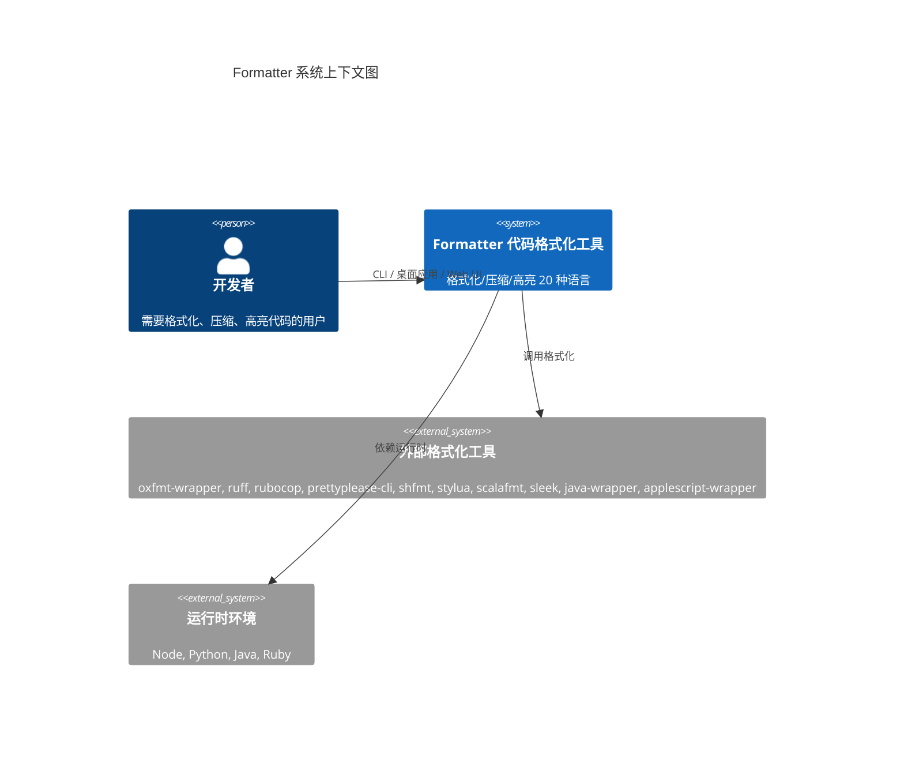

# 项目总览
> 生成时间：2026-08-01 ｜ 代码版本：master@9b25e57

## 1. 项目定位

**Formatter** 是一款一站式代码处理桌面工具，集**格式化**、**压缩**、**语法高亮**三大能力于一体，覆盖 20 种主流编程语言。项目通过"原生 Go 实现 + 配置驱动外部工具"的混合架构，在保证零依赖启动的同时，又能借助生态成熟工具获得专业级格式化效果。它同时提供 **Wails 桌面应用**、**CLI 命令行**、**Web UI** 三种使用模式，单文件部署即可运行，目标用户为需要频繁处理多语言代码的开发者、技术写作者与教学人员。

- **模块路径**：`github.com/formatter/formatter`
- **Go 版本**：1.26.1
- **入口文件**：[main.go](../../src/main.go)

## 2. 系统上下文 (C1)

## 3. 技术栈总览

| 类别 | 选型 | 说明 |
|------|------|------|
| 语言 | Go 1.26.1 | 单二进制构建 |
| 桌面框架 | Wails v2 | 系统 webview，跨平台桌面应用 |
| CLI 框架 | cobra | 子命令与持久化标志管理 |
| 语法高亮 | chroma/v2 | 20 种语言统一高亮引擎 |
| 压缩引擎 | tdewolff/minify/v2 | HTML / JS / CSS 压缩 |
| SQL 压缩 | ajitpratap0/GoSQLX | SQL 压缩 (CompactStyle) |
| 配置 | yaml.v3 + 内嵌 config.json | 默认配置随二进制内嵌 |
| 剪贴板 | golang.design/x/clipboard | 跨平台剪贴板读写 |
| 进度条 | schollz/progressbar/v3 | 二进制工具下载进度 |
| 前端 | 原生 HTML/JS/CSS | 嵌入式静态资源 |
| Web 服务 | 内置 HTTP server | `formatter serve` 启动 Web UI |

## 4. 业务域概览

| 业务域 | 源码目录 | 职责 |
|--------|----------|------|
| 语言检测 | [src/io/](../../src/io/) | 文件后缀与内容嗅探，自动识别语言 |
| 格式化 | [src/formatter/](../../src/formatter/) | 8 原生 + 10 外部工具，统一接口 |
| 压缩 | [src/compressor/](../../src/compressor/) | 6 原生压缩器，覆盖主流 Web 资源 |
| 语法高亮 | [src/highlighter/](../../src/highlighter/) | chroma v2 + 多套主题 |
| 工具管理 | [src/binary/](../../src/binary/) | 下载、解压、注册外部格式化工具 |
| 管道引擎 | [src/pipeline/](../../src/pipeline/) | format→compress→highlight 串联执行 |
| 配置管理 | [src/config/](../../src/config/) | 内嵌默认配置 + 用户自定义覆盖 |
| 前端界面 | [src/ui/](../../src/ui/) | Web UI 静态资源与 HTTP 服务 |
| 桌面应用 | [src/wailsapp/](../../src/wailsapp/) | Wails 绑定与窗口配置 |

## 5. 三种运行模式

| 模式 | 入口 | 使用场景 | 特点 |
|------|------|----------|------|
| **CLI 命令行** | [src/cli.go](../../src/cli.go) | 脚本化批处理、CI/CD 集成、管道流 | 支持 stdin/stdout、剪贴板、文件 IO；子命令 `format`/`compress`/`highlight`/`run`/`binary`/`langs`/`serve` |
| **Wails 桌面** | [src/main.go](../../src/main.go) → `runWails()` | 日常交互式使用、可视化预览 | 系统 webview 原生窗口，无浏览器依赖；前端通过 wailsjs 桥接 Go |
| **Web UI** | `formatter serve` → [src/ui/server.go](../../src/ui/server.go) | 远程访问、轻量使用、不便安装桌面端时 | 内置 HTTP 服务，可自动打开 Chrome app 模式窗口或浏览器标签页 |

### 5.1 模式判定逻辑

`main()` 通过 `isCLIMode()` 扫描 `os.Args`：若首个位置参数是已知子命令则进入 CLI 模式，否则启动 Wails 桌面应用；`serve` 子命令在 CLI 模式下额外启动 Web UI。

### 5.2 核心能力矩阵

| 能力 | 原生实现 (纯 Go) | 外部工具 (配置驱动) |
|------|------------------|---------------------|
| **格式化** (8 原生) | json, yaml, xml, html, go, ini, properties, toml | oxfmt-wrapper (css/js/ts), sleek (sql), ruff (python), rubocop (ruby), prettyplease-cli (rust), shfmt (shell), stylua (lua), scalafmt (scala), java-wrapper (java), applescript-wrapper (applescript) |
| **压缩** (6 原生) | json, xml, html, js, css, sql | — |
| **高亮** (20 语言) | chroma v2 统一处理 | — |
| **运行时依赖** (4) | — | node, python, java, ruby |

> 20 种语言：applescript, css, go, html, ini, java, javascript, json, lua, properties, python, ruby, rust, scala, shell, sql, toml, typescript, xml, yaml

## 6. 设计决策与权衡

项目立项时面临五项硬性约束，所有技术选型均围绕这些约束展开推理：

| 约束 | 说明 |
|------|------|
| **单文件部署** | 最终产物为一个可执行二进制，前端资源与默认配置通过 `//go:embed` 嵌入，禁止依赖外部运行时文件 |
| **最小化体积 (~23MB)** | 需在功能完整性与体积间取得平衡，外部工具按需下载而非全部嵌入 |
| **零前端依赖** | 纯原生 HTML/CSS/JS，不引入 React/Vue 等框架与构建工具链 |
| **跨平台** | macOS 提供 .app 桌面应用 + CLI；Linux/Windows 提供 CLI + Web UI |
| **Go 生态优先** | 核心能力尽量使用纯 Go 实现，减少 CGO 与外部二进制依赖 |

### 6.1 关键技术选型与备选方案

| 决策项 | 最终选择 | 被排除方案 | 排除原因 |
|--------|----------|------------|----------|
| 桌面框架 | Wails v2 (系统 WebView) | Electron / Fyne / Chrome app mode | 体积过大 (>100MB) / UI 灵活度不足 / 依赖用户已装浏览器 |
| CLI 框架 | Cobra | urfave/cli / 标准库 flag | 子命令组织弱 / 缺乏子命令与持久化标志 |
| 语法高亮 | Chroma v2 (纯 Go) | highlight.js / pygments | 需 JS 运行时 / 需 Python 运行时 |
| 资源压缩 | tdewolff/minify (纯 Go) | esbuild / 外部二进制 | 需 Node 运行时 / 增加部署复杂度 |
| SQL 格式化 | sleek (sqlformat-rs) | GoSQLX / 纯 tokenizer | GoSQLX 会规范化语义 (如大写关键字)；纯 tokenizer 格式化能力弱 |
| 配置嵌入 | `//go:embed` 标准库 | 外部配置文件 + 资源目录 | 违背单文件部署约束 |
| 前端 | 纯 HTML/CSS/JS | React / Vue | 对当前交互复杂度属过度设计，增加体积与构建链 |
| 核心复用 | appcommon.Core 三模式共享 | 每模式独立实现 | 维护成本高，三模式行为易产生差异 |

### 6.2 后果

**正面**：
- 单文件 ~23MB 跨平台易部署，一个二进制覆盖 macOS / Linux / Windows
- CLI / GUI / Web UI 共享 `Core`，行为一致，避免分叉
- 配置驱动扩展性强，新增语言/工具通常无需改代码
- 纯 Go 核心保证可维护性，便于交叉编译

**负面**：
- macOS 需 CGO（Wails 依赖 WKWebView），构建需 Xcode 工具链，交叉编译受限
- 前端无框架支持，复杂交互需手写 DOM 操作，后续维护成本随交互复杂度上升
- macOS GUI 需 [EnrichPath()](../../src/appcommon/path.go) 特殊处理 PATH 注入（GUI 应用不继承 shell PATH）
