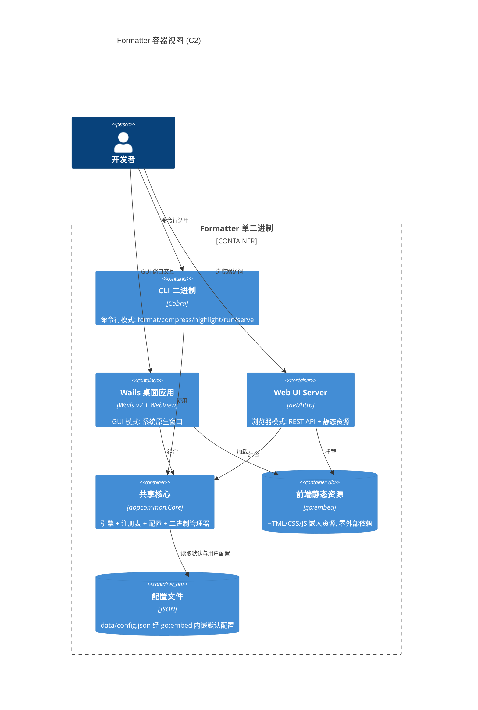
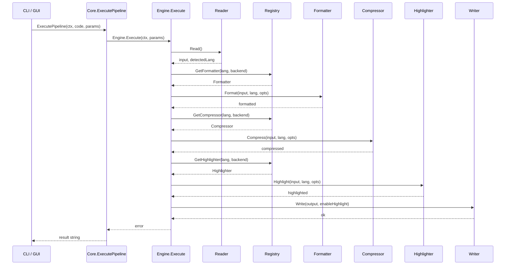

# 技术架构
> 生成时间：2026-08-01 ｜ 代码版本：master@9b25e57

## 1. 容器视图 (C2)

Formatter 编译为**单一二进制**，通过 `main()` 在启动时判定运行模式，三种模式共用同一份核心逻辑 `appcommon.Core`，保证 CLI、桌面、Web 三端行为完全一致。

三种模式均通过 [appcommon.NewCore()](../../src/appcommon/core.go#L59-L78) 构建共享核心，差异仅在入口与交互层：

| 模式 | 入口 | 核心构建 | 前端载体 |
|------|------|----------|----------|
| CLI | [NewRootCmd().Execute()](../../src/main.go#L48-L54) | Core 在子命令执行时按需创建 | 无 |
| GUI | [runWails()](../../src/main.go#L86-L108) | [wailsapp.NewApp()](../../src/wailsapp/wails.go#L57-L59) 内建 Core | `//go:embed ui/static` 静态资源 |
| Web | `formatter serve` → [Server.Start()](../../src/ui/server.go#L97) | [NewServer()](../../src/ui/server.go#L74-L95) 内建 Core | `//go:embed static` 静态资源 |

## 2. 组件视图 (C3)

### 2.1 入口层 (src/main.go)

[main()](../../src/main.go#L43-L58) 是唯一的程序入口，启动流程：

1. **注入默认配置**：`config.SetDefaultConfig(data.ConfigJSON)` 将 `//go:embed data/config.json` 的字节注入配置包。
2. **模式判定**：通过 [isCLIMode()](../../src/main.go#L63-L84) 扫描 `os.Args`。
3. **分发**：
   - CLI 模式 → `NewRootCmd().Execute()`（Cobra 命令分发，定义见 [src/cli.go](../../src/cli.go)）。
   - GUI 模式 → `runWails()` → `wails.Run()` 启动 WebView。

**isCLIMode() 判定逻辑**：遍历 `os.Args`，跳过全局标志及其值（`globalFlagsWithValue` 集合），遇到首个非标志参数时查表 `cliCommands`；命中已知子命令返回 true，未知子命令报错退出而非降级到 GUI，无位置参数（仅 GUI 启动场景）返回 false。

### 2.2 共享核心层 (src/appcommon/)

消除 Wails App 与 Web UI Server 的重复代码，统一持有引擎、注册表、配置与二进制管理器。

| 组件 | 职责 | 关键文件 |
|------|------|----------|
| [Core](../../src/appcommon/core.go#L32-L37) 结构体 | 聚合 Engine + Registry + Config + BinaryManager | [core.go](../../src/appcommon/core.go) |
| [NewCore()](../../src/appcommon/core.go#L59-L78) | 初始化流程：EnrichPath → 加载配置 → NewManager → BuildRegistry → New Engine → SetDetectionRules | core.go |
| [ExecutePipeline()](../../src/appcommon/core.go#L81-L90) | 委托给 Engine.Execute，封装 BufferReader/BufferWriter | core.go |
| [BuildRegistry()](../../src/appcommon/core.go#L339-L410) | 配置驱动注册所有 formatter/compressor/highlighter | core.go |
| [ListLanguages()](../../src/appcommon/core.go#L452-L469) | 返回语言支持信息 (formatter/compressor/highlighter 工具名) | core.go |
| [EnrichPath()](../../src/appcommon/path.go#L25-L61) | macOS PATH 增强，解决 GUI 应用不继承 shell PATH 问题 | [path.go](../../src/appcommon/path.go) |

### 2.3 管道引擎层 (src/pipeline/)

[Engine.Execute()](../../src/pipeline/engine.go#L40-L96) 是核心处理流程，串联「读取输入 → 语言检测 → 格式化 → 压缩 → 高亮 → 写入输出」：

| 阶段 | 控制条件 | 失败行为 |
|------|----------|----------|
| 读取输入 | 始终执行 | `read input: %w` |
| 语言解析 | `auto`/空 → 用检测结果；仍为空 → `text` | — |
| 格式化 | `EnableFormat` | 无 formatter 报错；失败 `format failed: %w` |
| 压缩 | `EnableCompress` | 无 compressor 时按 `CompressSkipUnsupported` 决定报错或跳过；失败 `compress failed: %w` |
| 高亮 | `EnableHighlight` | 无 highlighter 报错；失败 `highlight failed: %w` |
| 写入输出 | 始终执行 | — |

[ExecuteParams](../../src/pipeline/engine.go#L24-L38) 通过 `EnableFormat`/`EnableCompress`/`EnableHighlight` 三个布尔位控制阶段启停，并携带 `FormatterBackend`/`CompressorBackend`/`HighlighterBackend` 指定后端。工具查找由配置驱动：`registry.GetFormatter(lang, backend)`，backend 为空时返回注册顺序首个。

### 2.4 工具注册层 (src/registry/)

[Registry](../../src/registry/registry.go#L12-L18) 统一管理三类工具的注册与查找，内部用 `sync.RWMutex` 保护并发安全。

| 能力 | 说明 |
|------|------|
| 注册 | `RegisterFormatter`/`RegisterCompressor`/`RegisterHighlighter`，按语言追加到切片 |
| 别名 | [SetAliases()](../../src/registry/registry.go#L31-L35) 来自 config.json，仅对 formatter/compressor 查找生效；如 bash/sh/zsh → shell，yml → yaml |
| 后端优先 | `GetXxx(lang, preferBackend)` 优先返回匹配 backend 的实现，否则返回首个 |
| 语言集合 | [SupportedLanguages()](../../src/registry/registry.go#L122-L140) 合并三类注册器的语言键并排序 |

### 2.5 格式化层 (src/formatter/)

| 子模块 | 职责 | 关键文件 |
|------|------|----------|
| [interface.go](../../src/formatter/interface.go) | [Formatter](../../src/formatter/interface.go#L24-L29) 接口：Format / SupportedLanguages / Name / Type | interface.go |
| [native/](../../src/formatter/native) | 纯 Go 实现：json, yaml, xml, html, go, ini, properties, toml, sql | native/*.go |
| [tool/cmd_adapter.go](../../src/formatter/tool/cmd_adapter.go) | 外部工具适配器 CmdAdapter，封装命令行调用 | tool/cmd_adapter.go |

[BackendType](../../src/formatter/interface.go#L5-L21) 区分 `NativeGo`（"native"）与 `ToolBinary`（"tool"），用于 registry 的后端匹配与前端展示。

### 2.6 压缩层 (src/compressor/)

| 子模块 | 职责 | 关键文件 |
|------|------|----------|
| [interface.go](../../src/compressor/interface.go) | Compressor 接口定义 | interface.go |
| [native/](../../src/compressor/native) | 纯 Go 实现：json, xml, html, js, css, sql | native/*.go |
| [tool/cmd_adapter.go](../../src/compressor/tool/cmd_adapter.go) | 外部工具适配器 | tool/cmd_adapter.go |

原生压缩器实现策略：

| 语言 | 实现方式 | 文件 |
|------|----------|------|
| JSON | `encoding/json` 紧凑序列化 | [json.go](../../src/compressor/native/json.go) |
| XML | `encoding/xml` 紧凑序列化 | [xml.go](../../src/compressor/native/xml.go) |
| HTML / JS / CSS | `tdewolff/minify/v2` | html.go / js.go / css.go |
| SQL | GoSQLX CompactStyle + 纯文本回退 | [sql.go](../../src/compressor/native/sql.go) |

SQL 压缩优先用 [GoSQLX](../../src/compressor/native/sql.go#L13-L43) 解析为 AST 再以紧凑风格渲染；解析失败（方言特有语法）回退到纯文本压缩：移除注释、折叠空白、去除运算符周围冗余空格。

### 2.7 高亮层 (src/highlighter/)

[ChromaHighlighter](../../src/highlighter/chroma.go#L21-L23) 基于 chroma v2，单一实例服务所有配置语言。

| 能力 | 说明 | 文件 |
|------|------|------|
| 语言 → lexer 映射 | 配置驱动：`highlighter.options.lexer` 覆盖；未配置则用语言名本身（chroma v2 已注册主流语言名为别名） | [chroma.go](../../src/highlighter/chroma.go#L75-L80) |
| lexer 回退 | 仍找不到则用 `lexers.Fallback`（plaintext） | chroma.go |
| 主题回退 | 指定主题缺失则回退 `monokai` | chroma.go |
| 自定义主题 | 通过 `//go:embed themes/*.xml` 注册 eclipse / idea / idea-darcula | [themes_register.go](../../src/highlighter/themes_register.go) |
| 字体大小 | `opts.FontSize > 0` 时注入 `<pre>` 标签 style 属性 | [chroma.go](../../src/highlighter/chroma.go#L83-L85) |
| HTML 兼容输出 | `opts.CompatHTML=true` 时调用 [CompatHTML()](../../src/highlighter/compat.go#L30) 移除 `display:flex` + 空格/Tab→`&nbsp;` + `\n`→` `，解决 OneNote/Quiver 粘贴时空白与换行丢失 | [compat.go](../../src/highlighter/compat.go) |

前端在 [index.html](../../src/ui/static/index.html#L248-L268) 暴露 **15 种内置主题**：7 浅色（GitHub、Eclipse、IntelliJ IDEA、Emacs、Visual Studio、Xcode、Solarized Light）+ 8 深色（Monokai、IDEA Darcula、Dracula、GitHub Dark、Solarized Dark、Atom One Dark、Nord、Gruvbox）。

### 2.8 语言检测层 (src/io/)

[DetectLanguage()](../../src/io/detect.go#L102-L126) 实现三级检测，所有规则来自 config.json 的 `languages.*.detection`，代码不硬编码任何语言规则：

| 优先级 | 策略 | 说明 |
|--------|------|------|
| 1 | 扩展名 | 文件扩展名小写后直接映射 |
| 2 | shebang | 内容首行 `#!` 开头时匹配 shebang 正则 |
| 3 | 内容正则 | 前 2048 字节按 priority 顺序匹配强信号正则 |

[SetDetectionRules()](../../src/io/detect.go#L37-L91) 在 NewCore 启动与配置变更时由 appcommon 注入；无效正则被跳过不影响其他规则；内容规则按 (priority, lang) 排序保证确定性。

[InputReader](../../src/io/reader.go) / [OutputWriter](../../src/io/writer.go) 抽象支持文件与 stdin/stdout 两种 IO 形态。

### 2.9 二进制工具管理层 (src/binary/)

[Manager](../../src/binary/manager.go#L134-L138) 负责外部工具的安装、查找、下载、移除。

| 能力 | 说明 | 文件位置 |
|------|------|----------|
| 工具来源 | `preset`（预置嵌入）、`download`（URL 下载）、`install`（脚本安装） | [DownloadBinary()](../../src/binary/manager.go#L258-L273) |
| 自动安装 | [EnsureBinary()](../../src/binary/manager.go#L201-L216)：缺失时按来源自动下载或脚本安装 | manager.go |
| 查找顺序 | [FindBinary()](../../src/binary/manager.go#L222-L255)：配置路径 → 安装目录 → 系统 PATH | manager.go |
| 安装目录探测 | [NewManager()](../../src/binary/manager.go#L140-L172)：显式参数 → `FORMATTER_BIN_HOME` → App bundle/Resources/bin → exeDir/bin → exeDir/data/bin → ~/.formatter | manager.go |
| 运行时解析 | [ResolveRuntimePath()](../../src/binary/manager.go#L83-L101)：配置路径优先，其次系统 PATH | manager.go |

### 2.10 前端与 UI 层 (src/ui/)

[Server](../../src/ui/server.go#L34-L39) 组合 `appcommon.Core`，通过 `net/http` 提供 REST API 与静态资源托管。

| 端点类别 | 路由 | 文件位置 |
|----------|------|----------|
| 处理流水线 | `/api/format`, `/api/compress`, `/api/highlight`, `/api/run` | [server.go](../../src/ui/server.go#L100-L103) |
| 元信息 | `/api/languages`, `/api/status`, `/api/detect` | server.go |
| 二进制管理 | `/api/binaries`, `/api/binaries/install`, `/api/binaries/uninstall`, `/api/binaries/verify`, `/api/runtime/install` | server.go |
| 配置 | `/api/config` | server.go |
| CRUD | `/api/runtimes/*`, `/api/tools/*`, `/api/languages/*` | server.go |

静态资源经 `//go:embed static` 嵌入（零外部依赖），三页面：工作台、配置管理、关于。支持 Chrome app 模式或默认浏览器两种打开方式。

### 2.11 Wails 应用层 (src/wailsapp/)

[App](../../src/wailsapp/wails.go#L53-L55) 结构体包装 `appcommon.Core`，方法通过 Wails Bind 暴露给前端调用：

| 绑定方法 | 对应核心能力 |
|----------|--------------|
| Format() / Compress() / Highlight() / Run() | ExecutePipeline + 各 *Params 构建器 |
| Detect() | iocore.DetectLanguage |
| GetLanguages() | ListLanguages() |
| GetStatus() | Core.GetStatus() |
| GetBinaries() / InstallBinary() / UninstallBinary() / VerifyBinary() / InstallRuntime() | 二进制管理 |
| GetConfig() / SaveConfig() | 配置序列化与持久化 |
| AddRuntime/UpdateRuntime/DeleteRuntime, AddTool/UpdateTool/DeleteTool, AddLanguage/UpdateLanguage/DeleteLanguage | 配置 CRUD |

前端通过 `ui/static/wailsjs/go/wailsapp/App.js` 生成的 TypeScript 绑定调用上述方法。

## 3. 横切关注点

### 3.1 配置管理

| 层级 | 来源 | 机制 |
|------|------|------|
| 默认配置 | [data/config.json](../../data/config.json) | `//go:embed` 经 [data/embed.go](../../data/embed.go) 嵌入，启动时 `config.SetDefaultConfig` 注入 |
| 用户配置 | 可执行文件同目录 `config.json` | 覆盖默认配置，加载失败回退默认 |
| 配置结构 | aliases + binary(runtimes + binaries) + languages(20 种) | 见 [src/config/config.go](../../src/config/config.go) |

每语言配置包含四块：`detection`（extensions/shebangs/content/priority）、`formatter`、`compressor`、`highlighter`，外加可选 `indent`（tab_width/customIndentFrom）。

**indent.customIndentFrom 后处理机制**：部分外部工具不支持用户指定的 tab_width 参数，而是输出固定格式的缩进。通过 `customIndentFrom` 声明工具实际输出的缩进格式，程序在工具格式化完成后自动将缩进转换为用户指定的目标格式。`tab_width` 采用单字段语义（-1=Tab 缩进，>0=空格宽度，0=动态）。详见 [business-architecture.md](./business-architecture.md)。

### 3.2 错误处理

- 统一使用 `fmt.Errorf("context: %w", err)` 包装错误，保留错误链。
- Pipeline 各阶段独立报错：`format failed` / `compress failed` / `highlight failed` / `read input`。
- 无 sentinel error，无自定义 error 类型——项目规模适中，保持简洁。

### 3.3 平台适配

三平台构建统一由 `scripts/run_tools.sh build` 完成（系统依赖安装、CGO 参数、build tags、图标、打包），
CI workflow 只做 runner 引导与产物上传，不在其中写构建逻辑。

| 平台 | 构建参数 | 说明 |
|------|----------|------|
| macOS | `CGO_ENABLED=1`，build tags: `desktop,production` | Wails WebView 依赖 cgo；链接 `-framework UniformTypeIdentifiers`；跨架构 (amd64↔arm64) 加 `-target clang`；最低部署版本 12.0；ad-hoc 签名；打包 .app + 7z (回退 zip) |
| Linux | `CGO_ENABLED=1`，build tags: `desktop,production[,webkit2_41]` | GTK3 + WebKit2GTK (pkg-config)；脚本自动探测 4.0/4.1，使用 4.1 时追加 `webkit2_41` tag；打包 tar.gz 含 .desktop + install.sh |
| Windows | `CGO_ENABLED=0`，build tags: `desktop,production` | go-webview2 通过 `syscall.NewLazyDLL` 动态加载 WebView2Loader.dll，无需 MinGW/gcc；打包 zip |
| 桌面 App 编译约束 | — | 不可跨 OS 编译（Linux 需宿主 GTK），脚本在目标 OS ≠ 宿主 OS 时告警；仅 macOS 支持同 OS 跨架构交叉 |
| 平台特定文件 | `//go:build` 标签 | 用于平台特定源文件 |
| PATH 增强 | [EnrichPath()](../../src/appcommon/path.go#L25-L61) | 仅 macOS 生效，解决 GUI 应用 PATH 问题 |

### 3.4 PATH 增强 (macOS)

**问题**：从 Finder 启动的 GUI 应用不继承用户 shell 的 PATH 修改（Homebrew 的 `/opt/homebrew/bin`、nvm 的 node 路径等），导致 `exec.LookPath` 找不到 node/python/ruby 等运行时；而终端启动的 CLI/测试进程继承完整 PATH，产生「测试可见但 App 不可见」差异。

**方案**（[src/appcommon/path.go](../../src/appcommon/path.go)）：

1. 通过 `$SHELL -l -c 'echo $PATH'` 获取登录 shell 的完整 PATH（3 秒超时兜底）。
2. 补充常见目录：`/usr/local/bin`、`/usr/local/sbin`、`/opt/homebrew/bin`、`/opt/homebrew/sbin`。
3. 扫描 `~/.nvm/versions/node/*/bin`，将已安装 node 版本的 bin 目录加入 PATH。
4. `mergePathEntries` 去重合并；函数幂等，进程生命周期内仅首次生效。
5. Linux / Windows 为 no-op。

## 4. 核心数据流

下图展示一次完整流水线（format + compress + highlight）的调用时序，CLI 与 GUI 路径仅在入口与 IO 形态上不同，核心调用链完全一致。

