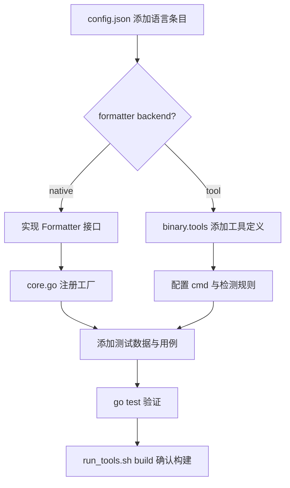

# 开发维护手册
> 生成时间：2026-08-01 ｜ 代码版本：master@9b25e57

本文档是 Formatter 项目的开发参考手册，涵盖代码规范、核心设计模式、新增功能流程、测试规范、构建系统与硬约束。适用于日常开发与功能扩展。

---

## 1. 代码规范

### 1.1 包命名
- 小写单词, 不用下划线/驼峰: `appcommon`, `pipeline`, `formatter`
- 避免无意义包名: 不用 `util`, `common`, `helpers`

### 1.2 文件命名
- 小写蛇形: `sql.go`, `test_cases.json`
- 平台特定: `_darwin.go`, `_windows.go` (如有)

### 1.3 接口设计
- 接口定义在消费方, 小接口组合
- 三大核心接口: [Formatter](../src/formatter/interface.go), [Compressor](../src/compressor/interface.go), [Highlighter](../src/highlighter/interface.go)

### 1.4 错误处理
- 统一 `fmt.Errorf("context: %w", err)` 包装
- Pipeline 各阶段独立报错: "format failed: ...", "compress failed: ..."

---

## 2. 核心设计模式

### 2.1 配置驱动架构

**所有语言/工具/检测规则均由 `data/config.json` 驱动，新增语言支持无需修改 Go 代码 (除 native 格式化器外)。**

关键配置驱动点:
- **语言检测**: `detection.extensions` / `detection.shebangs` / `detection.content` / `detection.priority` → [io.SetDetectionRules()](../src/io/detect.go) 编译
- **工具命令模板**: `cmd` 数组中的 `{tab_width}` / `{ext}` / `{indent_style}` 等占位符 → [config.ExpandCmdArgs()](../src/config/cmd_args.go) 替换
- **Native 格式化器注册**: `formatter.tool` 名 → `nativeFormatterFactories` 工厂映射 → [BuildRegistry()](../src/appcommon/core.go) 遍历注册
- **外部工具注册**: `backend="tool"` → `CmdAdapter` 自动注册
- **高亮器**: `highlighter.options.lexer` 覆盖 chroma lexer 名，默认使用语言名
- **前端语言映射**: 扩展名↔语言映射从 `detection.extensions` 动态构建

### 2.2 注册表模式 (registry)

```go
// src/registry/registry.go
type Registry struct {
    formatters   map[string][]formatter.Formatter   // 语言 → 格式化器列表
    compressors  map[string][]compressor.Compressor
    highlighters map[string][]highlighter.Highlighter
    aliases      map[string]string                   // 语言别名 (bash→shell, yml→yaml)
}
```

`BuildRegistry()` 遍历 `cfg.Languages`，根据 `backend` 类型注册处理器:
- `backend="native"` → 查工厂映射 → 注册 Go 原生实现
- `backend="tool"` → 创建 `CmdAdapter` → 注册外部工具适配器

### 2.3 二进制工具管理 (binary)

```
ToolSource 类型:
  - "download": URL 下载并打包进 App (构建时 install-bin.sh 下载)
  - "preset":   已静态打包在 data/bin/ 中 (如 wrapper 脚本)
  - "install":  通过命令安装 (如 gem install rubocop)，不打包
```

工具查找优先级: `配置 Path > 安装目录 (data/bin) > 系统 PATH`

---

## 3. 新增功能流程

### 3.1 新增语言支持 (仅外部工具)

只需修改 `data/config.json`，无需改 Go 代码:

```json
"kotlin": {
  "formatter": {
    "backend": "tool",
    "tool": "ktlint",
    "cmd": ["--stdin", "--log-level=error"]
  },
  "detection": {
    "extensions": [".kt", ".kts"],
    "content": ["^\\s*(package|import)\\s+kotlin"]
  }
}
```

同时在 `data/config.json` 的 `binary.tools` 中添加工具定义 (见 §3.4)。

### 3.2 新增 Native 格式化器

1. **实现格式化器** — 在 `src/formatter/native/` 下创建文件，实现 `formatter.Formatter` 接口:

```go
package native

type KotlinFormatter struct{}

func NewKotlinFormatter() *KotlinFormatter { return &KotlinFormatter{} }

func (f *KotlinFormatter) Format(input []byte, lang string, opts formatter.FormatOptions) ([]byte, error) {
    // 格式化逻辑
    return output, nil
}

func (f *KotlinFormatter) SupportedLanguages() []string { return []string{"kotlin"} }
func (f *KotlinFormatter) Name() string                 { return "native-kotlin" }
func (f *KotlinFormatter) Type() formatter.BackendType  { return formatter.NativeGo }
```

2. **注册工厂** — 在 [src/appcommon/core.go](../src/appcommon/core.go) 的 `nativeFormatterFactories` 中添加一行:

```go
var nativeFormatterFactories = map[string]func() formatter.Formatter{
    // ... 已有映射
    "kotlin": func() formatter.Formatter { return formatternative.NewKotlinFormatter() },
}
```

3. **配置** — 在 `data/config.json` 中设置 `backend: "native"`:

```json
"kotlin": {
  "formatter": { "backend": "native", "tool": "kotlin" },
  "detection": { "extensions": [".kt"] }
}
```

### 3.3 新增 Native 压缩器

1. 创建 `src/compressor/native/<lang>.go`, 实现 Compressor 接口
2. 在 [core.go](../src/appcommon/core.go) 的 `nativeCompressorFactories` 添加一行映射
3. 在 data/config.json 中设置 `compressor.backend = "native"`, `compressor.tool = "<lang>"`

### 3.4 新增二进制工具

在 `data/config.json` 的 `binary.tools` 数组中添加:

```json
{
  "name": "ktlint",
  "languages": ["kotlin"],
  "version": "1.3.1",
  "runtime": "",
  "executable": "ktlint",
  "source": "download",
  "urls": {
    "darwin/*": "https://github.com/pinterest/ktlint/releases/download/{version}/ktlint",
    "linux/*":  "https://github.com/pinterest/ktlint/releases/download/{version}/ktlint",
    "windows/amd64": "https://github.com/pinterest/ktlint/releases/download/{version}/ktlint.bat"
  },
  "archive": "raw",
  "verify_cmd": "{exe} --version"
}
```

关键字段:
- `runtime`: 空=独立二进制; `java`/`node`/`python`/`ruby`=需运行时
- `source`: `download`(下载打包) / `preset`(已在 data/bin) / `install`(命令安装)
- `urls`: key 为 `os/arch`，支持 `os/*` 和 `*` 通配符; `{version}` 占位符
- `archive`: `raw` / `tar.gz` / `tar.xz` / `zip`
- `run_cmd`: 自定义执行模板 (如 `"{runtime} -jar {exe}"`)，支持 `{runtime}` `{exe}` 占位符
- `verify_cmd`: 版本验证命令模板

### 3.5 新增 Wrapper 脚本

当工具不支持 stdin 或需要特殊处理时，创建 wrapper 脚本放入 `data/bin/`:

```bash
#!/bin/sh
# data/bin/ktlint-wrapper
# ktlint 不支持 stdin，通过临时文件中转
TMPFILE=$(mktemp /tmp/ktlint-XXXXXX.kt)
cat > "$TMPFILE"
ktlint --log-level=error "$TMPFILE"
rm -f "$TMPFILE"
```

在 config.json 中设置 `source: "preset"` 和 `executable: "ktlint-wrapper"`。

### 3.6 新增语言完整流程



完整步骤:
1. 在 `data/config.json` 的 `languages` 中添加语言配置 (formatter/compressor/detection/indent)
2. 如需外部工具，在 `binary.tools` 中添加工具定义
3. 如工具不支持 stdin，创建 wrapper 脚本放入 `data/bin/` (source=preset)
4. 在 `tests/testdata/` 添加测试文件 (`test.<ext>`)
5. 在 `tests/testdata/test_cases.json` 添加测试用例定义
6. 运行 `./scripts/run_tools.sh test` 验证
7. 运行 `./scripts/run_tools.sh build` 确认构建通过

---

## 4. 命令参数模板

### 4.1 cmd 占位符 (ExpandCmdArgs)

`cmd` 数组支持的占位符 ([config.ExpandCmdArgs()](../src/config/cmd_args.go) 解析):

| 占位符 | 含义 | 来源 |
|--------|------|------|
| `{tab_width}` | 缩进宽度 | 语言 IndentConfig > 全局 FormatConfig |
| `{use_tabs}` | 是否使用 tab（由 `tab_width=-1` 派生） | 同上 |
| `{indent_style}` | "space" 或 "tab" | 同上 |
| `{line_ending}` | 行结束符 | FormatConfig |
| `{ext}` | 文件扩展名 (无点) | detection.extensions[0] |
| `{lang}` | 语言名称 | 当前语言 |
| `{dialect}` | SQL 方言 | options.dialect (默认 ansi) |
| `{edition}` | Rust edition | options.edition (默认 2021) |
| `{line_length}` | 行长度限制 | options.line_length (默认 88) |
| `{options.xxx}` | 自定义选项 | ToolConfig.Options |

### 4.2 run_cmd 占位符 (BuildToolCmd)

仅用于 `runtime != ""` 的工具（如 JAR），支持 `{runtime}` 和 `{exe}` 两个占位符:

| 占位符 | 说明 | 示例值 |
|--------|------|--------|
| `{runtime}` | 运行时可执行文件路径 | `/usr/bin/java` |
| `{exe}` | 工具可执行文件路径 | `google-java-format.jar` |

---

## 5. 测试规范

### 5.1 测试原则

- **真实环境**: 使用 `data/config.json` 和 `data/bin/` 中的真实工具，不 mock
- **全覆盖**: 测试用例必须覆盖所有配置的语言 (格式化/压缩/高亮)
- **隔离性**: 使用 `t.TempDir()` 隔离文件操作; `setupCRUDTest()` 备份恢复配置
- **工具可用性**: 外部工具未安装时使用 `toolAvailable()` 检查并 `t.Skip()` 跳过

### 5.2 TestMain 初始化

```go
// tests/main_test.go
func TestMain(m *testing.M) {
    // 1. 读取 data/config.json 注入为默认配置
    config.SetDefaultConfig(configData)
    // 2. 设置 FORMATTER_BIN_HOME=data/bin
    os.Setenv("FORMATTER_BIN_HOME", binDir)
    // 3. 检测 RVM/rbenv，将 gem bin 加入 PATH (使 rubocop 等工具可被找到)
    augmentPathForGemTools()
    // 4. 切换到项目根目录
    os.Chdir(projectRoot)
    // 5. 初始化 testCore
    testCore = appcommon.NewCore(binDir)
}
```

### 5.3 配置化测试用例

测试用例定义在 [tests/testdata/test_cases.json](../tests/testdata/test_cases.json)，添加用例只需修改 JSON，无需改 Go 代码:

```json
{
  "languages": {
    "kotlin": {
      "file": "test.kt",
      "backend": "tool",
      "tool": "ktlint",
      "format_checks": ["fun", "main"]
    }
  }
}
```

对应的测试数据文件放在 `tests/testdata/test.kt`。

测试数据组织:
- 位于 `tests/testdata/`, 按语言分目录管理
- 每种语言目录包含: 输入文件 (`input.<ext>`, `edge_input.<ext>` 等) 与期望输出文件 (`format_2spaces.expected`, `compress.expected` 等)
- 用例在 test_cases.json 中定义, 指定 `operation`/`options`/`methods`
- 期望文件 (.expected) 由开发者手动编写维护; `-update` 模式生成 `.output` 供审查, 永远不会覆盖 `.expected`

### 5.4 测试文件组织

| 文件 | 职责 |
|------|------|
| `main_test.go` | TestMain 初始化、PATH 增强 |
| `helpers_test.go` | 共享辅助函数 (setupCRUDTest, toolAvailable) |
| `test_cases_test.go` | 配置化语言测试 (格式化/压缩/高亮/CLI) |
| `config_test.go` | 配置加载与解析测试 |
| `crud_test.go` | 配置 CRUD 操作测试 |
| `binary_test.go` | 二进制工具基本测试 |
| `core_misc_test.go` | Core 杂项 (FormatParams/ListBinaries/Install) |
| `io_test.go` | IO 读写与语言检测测试 |
| `pipeline_engine_test.go` | 流水线引擎测试 |

### 5.5 运行测试

```bash
# 运行全部测试
go test ./tests/ -timeout 120s

# Golden File 格式化/压缩/美化测试
go test ./tests/ -run TestCases

# 生成测试输出文件 (.output)，用于审查 (不覆盖 .expected)
go test ./tests/ -run TestCases_GoldenFiles -update

# 运行并生成覆盖率
go test ./tests/ -coverpkg=./src/... -coverprofile=coverage.out -timeout 120s

# 查看覆盖率详情
go tool cover -func=coverage.out

# 静态检查
go vet ./tests/ ./src/...

# 通过脚本运行
./scripts/run_tools.sh test
```

### 5.6 测试安全约束

**禁止在测试中对 `data/bin/` 中的预置工具执行 UninstallBinary/RemoveBinary**，会删除真实文件。测试卸载逻辑时使用不在 `data/bin/` 中的工具名 (如 `rubocop`，source=install)。

---

## 6. 构建系统

### 6.1 run_tools.sh 命令表

交互式菜单 + CLI 命令，支持数字/首字母匹配:

| 命令 | 简写 | 说明 |
|------|------|------|
| `build` | `b` | 构建 App (二进制 + .app) |
| `install-bin` | `i` | 下载三方二进制工具 |
| `test` | `t` | 运行单元测试 |
| `clean` | `c` | 清理构建产物 |
| `run` | `r` | 编译并运行桌面 App [默认] |
| `server` | `s` | 编译并运行 Web Server |
| `exit` | `q` | 退出 |

选项: `--platform=OS/ARCH` `--tool=<name>` `--all` `--addr=<addr>` `--no-open` `--browser`

### 6.2 构建约束

| 平台 | CGO | Build Tags | 备注 |
|------|-----|------------|------|
| macOS | `CGO_ENABLED=1` | `desktop,production` | 链接 `-framework UniformTypeIdentifiers`; 跨架构加 `-target clang`; 打包 .app |
| Linux | `CGO_ENABLED=0` | 无 | 纯 Go 构建，CLI + Web UI |
| Windows | `CGO_ENABLED=0` | 无 | 纯 Go 构建，CLI + Web UI |

- **跨编译**: 跳过图标生成
- **二进制 strip**: 下载后自动 strip 减小体积 (跳过 Windows/JAR/脚本); strip 后用 verify_cmd 验证，失败则还原

### 6.3 install-bin.sh 约束

- 支持代理: `USE_GH_PROXY` 启用, `GH_PROXY_URL` 自定义地址
- 下载超时: `--max-time 600`
- 代理重试: GitHub 直连失败时自动切换代理
- 失败清理: 下载失败时清理残留文件

---

## 7. 硬约束 (不可违反)

1. **配置驱动**: 新增语言/工具优先通过 config.json 配置，不硬编码
2. **单文件部署**: App 必须是单个可执行文件，前端资源通过 `//go:embed` 嵌入
3. **前端零依赖**: 纯原生 HTML/CSS/JS，不引入外部框架/库
4. **App 体积**: 最小化 (当前 ~23MB)，二进制工具下载后自动 strip
5. **配置存储**: 配置文件与 App 可执行文件同目录 (App 模式) 或 `data/config.json` (开发模式)
6. **`~` 路径**: 配置中的 `~` 前缀自动展开为 `$HOME` (`config.ExpandHomePath`)
7. **嵌入回退**: 嵌入的默认配置失败时回退到硬编码默认值
8. **CLI 入口**: CLI 命令直接通过 App 二进制执行，不创建独立二进制文件
9. **运行时工具**: JAR/脚本类工具跳过可执行权限检查 (由解释器执行)
10. **测试真实环境**: 测试用例使用 `data/config.json` 真实配置，不 mock 工具或运行时

---

## 8. 关键代码位置速查

| 任务 | 文件 | 关键函数/结构 |
|------|------|--------------|
| 添加 CLI 命令 | [src/cli.go](../src/cli.go) | `NewRootCmd()` |
| 添加 Wails 绑定 | [src/wailsapp/wails.go](../src/wailsapp/wails.go) | App struct 方法 |
| 添加 Web API | [src/ui/server.go](../src/ui/server.go) | Echo 路由 |
| 添加前端页面 | [src/ui/static/](../src/ui/static/) | index.html / app.js / style.css |
| 注册 native 格式化器 | [src/appcommon/core.go](../src/appcommon/core.go) | `nativeFormatterFactories` |
| 注册 native 压缩器 | [src/appcommon/core.go](../src/appcommon/core.go) | `nativeCompressorFactories` |
| 修改配置结构 | [src/config/config.go](../src/config/config.go) | Config / LangConfig / ToolConfig |
| 添加命令占位符 | [src/config/cmd_args.go](../src/config/cmd_args.go) | `buildTemplateVars()` |
| 修改语言检测 | [data/config.json](../data/config.json) | `detection` 字段 |
| 添加测试用例 | [tests/testdata/test_cases.json](../tests/testdata/test_cases.json) | languages / edge_cases |
| 修改构建流程 | [scripts/run_tools.sh](../scripts/run_tools.sh) | step_* 函数 |
| 修改工具下载 | [scripts/install-bin.sh](../scripts/install-bin.sh) | install_binary_tool 函数 |

---

## 9. 配置文件说明

| 配置节 | 说明 |
|--------|------|
| aliases | 语言别名映射 |
| binary.runtimes | 运行时定义 (node/python/java/ruby) |
| binary.tools | 外部工具定义 |
| format | 全局格式化参数 (tab_width, line_ending) |
| highlight | 高亮配置 (style, line_numbers, font_size, compat_html) |
| languages | 20 种语言的检测+格式化+压缩+高亮配置 |

---

## 10. 常见问题

- Q: macOS GUI 模式找不到 node/python? A: EnrichPath() 自动补充 PATH, 详见 [path.go](../src/appcommon/path.go)
- Q: 如何添加新的高亮主题? A: 在 src/highlighter/themes/ 添加主题 XML 文件 (由 themes_register.go 自动注册) + index.html 的下拉选项
- Q: SQL 格式化后关键字被修改? A: SQL 格式化使用 sleek 工具 (基于 sqlformat-rs)，默认大写关键字。GoSQLX 仍用于 SQL 压缩 (CompactStyle)。
- Q: 如何切换格式化后端? A: CLI 使用 --formatter-backend native/tool, 配置文件设置 formatter.backend
- Q: 高亮 HTML 粘贴到 OneNote/Quiver 缩进丢失? A: 启用兼容输出 (highlight.compat_html=true 或 CLI --compat-html), 详见 [compat.go](../src/highlighter/compat.go)
