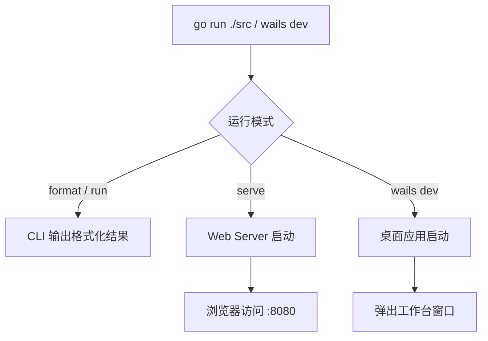

# 新人上手指南
> 生成时间：2026-08-01 ｜ 代码版本：master@9b25e57

## 1. 前置准备
- Go 1.26.1+ (来自 go.mod)
- macOS: 需 Xcode Command Line Tools (CGO 依赖): `xcode-select --install`
- IDE: VS Code (gopls) 或 GoLand
- 可选运行时: Java (java-wrapper), Ruby (rubocop)
- Wails CLI: `go install github.com/wailsapp/wails/v2/cmd/wails@v2.13.0` (开发模式需要)

## 2. 拉取与导入
```bash
git clone <repo-url> formatter
cd formatter
go mod download
```

## 3. 项目结构速览
```
formatter/
├── src/                    # 源码
│   ├── main.go             # 入口: CLI/GUI 模式分发
│   ├── cli.go              # CLI 命令定义 (cobra)
│   ├── appcommon/          # 共享核心 (Core, BuildRegistry, PATH增强)
│   ├── config/             # 配置加载与嵌入
│   ├── pipeline/           # 管道引擎 (格式化→压缩→高亮)
│   ├── registry/           # 工具注册表
│   ├── formatter/          # 格式化器 (interface + native + tool)
│   ├── compressor/         # 压缩器 (interface + native + tool)
│   ├── highlighter/        # 语法高亮 (chroma)
│   ├── io/                 # 语言检测与 I/O
│   ├── binary/             # 二进制工具管理
│   ├── ui/                 # Web UI (server + static)
│   └── wailsapp/           # Wails 桌面应用
├── data/                   # 配置与资源
│   ├── config.json         # 默认配置 (20语言, 4运行时, 工具定义)
│   ├── embed.go            # //go:embed 嵌入配置
│   └── bin/                # 预置二进制工具与 wrapper 脚本
├── tests/                  # 测试
│   ├── testdata/           # 测试数据 (按语言分目录)
│   │   ├── test_cases.json     # Golden File 测试配置 (格式化/压缩/美化)
│   │   ├── json/               # JSON 语言测试输入与期望输出
│   │   ├── go/                 # Go 语言测试输入与期望输出
│   │   ├── sql/                # SQL 语言测试输入与期望输出
│   │   └── ...                 # 其余语言目录
│   └── *_test.go           # 测试代码
├── scripts/                # 构建脚本
│   ├── run_tools.sh        # 交互式构建菜单
│   └── install-bin.sh      # 工具下载脚本
├── docs/                   # 文档
├── go.mod / go.sum
└── wails.json              # Wails 项目配置
```

## 4. 启动方式

| 模式 | 命令 | 说明 |
|------|------|------|
| CLI 格式化 | `go run ./src format -l go -i input.go` | 单步格式化 |
| CLI 完整流程 | `go run ./src run -l json -i input.json` | 格式化→压缩→高亮 |
| Wails 开发模式 | `wails dev` | 桌面应用热重载 |
| Web UI | `go run ./src serve --addr :8080` | 启动 Web 服务 |
| 构建桌面应用 | `./scripts/run_tools.sh` | 交互菜单 (build/run/server) |



## 5. 验证启动成功
- CLI: 检查输出格式化后的代码
- Wails: 桌面应用窗口弹出, 显示"工作台"页面
- Web UI: 浏览器打开 http://localhost:8080

## 6. 第一个任务: 新增一种语言的格式化支持
Step-by-step guide:
1. 在 data/config.json 的 languages 中添加语言配置 (detection + formatter)
2. 如为 native 实现: 在 src/formatter/native/ 创建 Go 文件, 实现 Formatter 接口
3. 在 src/appcommon/core.go 的 nativeFormatterFactories 添加工厂映射
4. 在 tests/testdata/ 添加测试数据文件
5. 在 tests/testdata/test_cases.json 添加测试用例
6. 运行 `go test ./tests/` 验证

## 7. 推荐学习路径
1. 读 [src/main.go](../src/main.go) — 理解入口与模式分发
2. 读 [src/appcommon/core.go](../src/appcommon/core.go) — 理解 Core 结构与 BuildRegistry
3. 读 [src/pipeline/engine.go](../src/pipeline/engine.go) — 理解处理管道
4. 读 [data/config.json](../data/config.json) — 理解配置结构
5. 读 [docs/architecture/overview.md](../architecture/overview.md) — 全局视角
